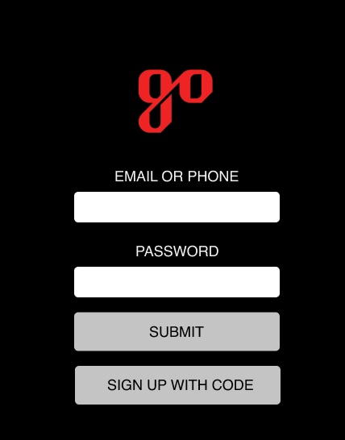

### Hackathon (Data Science Part)

#### Team Members: Saiful Hasan & Taylor Davenport & Kelsey Payne & Ipsita Rao & james white 

Design by : Taylor Davenport & Kelsey Payne

### Problem Statement
The recent Covid 19 pandemic has changed a lot of our lifestyle and the way we do things. When live sports and entertainment return, the event organizers would be required to pay an enhanced focus on consumer safety and well-being. As a result, being in the event business, Octagon is looking for creative technology solutions to limit contact and encourage social distancing practices on-site. Therefore, we the team, Handoff, have developed an innovative contactless consumer check-in platform to be used on-site at live events.  

### The role of data scientists in introducing innovative services 
Data science can be a very useful tool for any kind of decision-making process at any stage of a product or service. In our project, we aimed to propose a creative technology solution to limit contact and encourage social distancing practices on the event site. Since it's a new technology solution, we need to do data analysis before we start the system, even after we start the system. Besides, we would be utilizing the data science techniques before we start the system to build models to predict or at least get broader pictures of the prospects. We need to use the data science techniques along the way after we introduce the new innovative technology solutions in the target market for multiple reasons.

- To understand the consumer reaction and attitude towards our new contact-less check-in system. It's is essential to upgrade our system over time according to the consumers' demand and expectations.
- To predict the cost-benefit analysis and profitability.
- To understand consumer behavior, which is essential to establish consumer loyalty.
- to get in depth insight for our next innovative solution.

##### Probable data sources
- Survey data; 
    - A customized survey specifically on our check-in system
- Social media platforms (such as Facebook, Twitter, Reddit); 
    - we could use the posts, comments, and discussions regarding our new contact-less check-in system 
- Consumer reviews, ratings from several sources; 
    - on-site review options, reviews posted on our website/app, or reviews or rating posted on other review pages/portals
- The data we get from our system; 
    - Behavior related to check-in and app usage

##### Probable contribution
- Graphic visualization of the user usage to see consumer behavioral change 
- Sentiment analysis of users' posts, comments, reviews, ratings
- Investiagting the usage trend
- Figuring out the features that can predict the future usage 
- Time-series analysis to predict the future usage
- Porift variance analysis before and after introducing the new check-in system

##### Limitations and our chosen data sets
However, since its completely a new solution in the market, and also the current phenomena are unprecedented, we don't have any historical data specifically related to the problem we are facing now as well the solution we are proposing. In such cases, We have decided to look into other relevant data to get somehow a picture to see how our new contactless check-in system might work out. So, the corresponding data we chose to look into the are:
- technology adaptation rate of our consumers. There are several parameters to look into to know how a consumer segment is technological adaptive. However, since in our new contact-less solution, the consumers need to use the internet at some point, we chose to see how much our target consumers use the internet as their technological acceptance rate. 
- since the consumers need to use the kiosk at some point to make the check-in, we chose to see the acceptance of kiosk in the market. To see this, we used the LINK NYC kiosk usage data. 
- then we used scraped data from subreddit and twitters to see our consumers' attitude to social distance, mask, and wrist band. The reasons we decided to investigate these factors are: 
     - We are introducing this new contact-less check-in system to keep the social distance, and
     - At the entry, our user can do check-in using their mobile app, or bar-code printed mask. If the user doesn't want to or cannot use a mobile app to scan at the kiosk, the consumer could use a mask to make the check-in. So, we wanted to see users' acceptance or attritudes towards mask in geenral. Besides, since our mask would be with QR code which is completely new in the market we decided to see the cosumers' attitude towards the relevant product, magic band offered by Disney world. Thus, we thought that investigating these features would give us an overall idea of how consumers might react to our new innovative system.

Our data sources:
- Technological adaptation (secondary dataset; [Technology Adaptation](https://ourworldindata.org/technology-adoption))
- Attitude towards Kiosk :  LINK NYC (secondary dataset; [LINK NYC](https://data.world/city-of-ny/69wu-b929))
- Attitude towards Mask : The title texts of the subreddit submissions [subreddit Mask](https://www.reddit.com/r/Masks/)
- Attitude towards Social distance : The tweets from twitters with query 'social distance' in NYC location for the period of 3 months March to May. The dataset was collected for a project we did during our GA DSI program
- Attitude towards magic wrist band - The title texts of the subreddit submissions where 'magic band' phrase was present [subreddit Disney World](https://www.reddit.com/r/WaltDisneyWorld/)

Another Limitation is that we have minimal data, which is obviously not enough. So, instead of generalizing the results, we would say that the insights we got analysis we did with limited data set helped us to give some leads to move forward. However, our findings from the below studies are consistent with interview data our team, mainly the UX team collected.   

### Using VEDAR for Sentiment Analysis
For our sentiment analysis, we used VADER(Valence Aware Dictionary and sEntiment Reasoner).VADER is specifically used to sentiments expressed in social media. It is fully open-sourced under the [MIT License](https://pypi.org/project/vaderSentiment/). It is easy-to-use and powerful package which has been found quite successful when dealing with social media texts, movie reviews, and product reviews. 

VADER has a lot of advantages over traditional methods for [Sentiment Analysis](https://medium.com/analytics-vidhya/simplifying-social-media-sentiment-analysis-using-vader-in-python-f9e6ec6fc52f#:~:text=Advantages%20of%20using%20VADER,methods%20of%20Sentiment%20Analysis%2C%20including%3A&text=It%20doesn't%20require%20any,online%20with%20streaming%20data%2C%20an). While it works well on social media type text, it can also readily generalize to different domains. VADER doesn’t require your dataset to split into traning and testing data, which is perfect for our study in utilizing an unsupervised learning model. It is constructed from a generalizable, valence-based, human-curated gold standard sentiment lexicon. It does not severely suffer from a speed-performance tradeoff. It doesn't occupy much RAM to run and that's why it is fast enough to be used online with streaming data.

VADER outputs four scores - positive score, neutral scores, negative scores, and composite score (a mix of the first three scores). The [Compound score](https://www.geeksforgeeks.org/python-sentiment-analysis-using-vader/) is a metric that calculates the sum of all the lexicon ratings which have been normalized between -1(most extreme negative) and +1 (most extreme positive). In our analysys we only generated three scores - positive, negtaive, and neutral.

### Reference
[1] [Technology Adaptation](https://ourworldindata.org/technology-adoption)
[2] [LINK NYC](https://data.world/city-of-ny/69wu-b929)
[3] [subreddit Mask](https://www.reddit.com/r/Masks/)
[4] [subreddit Disney World](https://www.reddit.com/r/WaltDisneyWorld/)
[5] [IAPP](https://iapp.org/resources/article/state-comparison-table/)
[6] [MIT](https://pypi.org/project/vaderSentiment/)
[7] [geeksforgeeks](https://www.geeksforgeeks.org/python-sentiment-analysis-using-vader/)
[8] [Parul Pandey](https://medium.com/analytics-vidhya/simplifying-social-media-sentiment-analysis-using-vader-in-python-f9e6ec6fc52f#:~:text=Advantages%20of%20using%20VADER,methods%20of%20Sentiment%20Analysis%2C%20including%3A&text=It%20doesn't%20require%20any,online%20with%20streaming%20data%2C%20an)
[9] [VADER Coder](https://github.com/tangina-a)